# Torsion Scan Guardian — Phase 0–5 Report

**Project:** Active-learning pipeline for stabilising MACE-OFF molecular dynamics on flexible drug-like molecules.
**Scope of this report:** Environment scaffolding (Phase 0), MACE-OFF integration and an *input-perturbation* uncertainty ensemble with diagnostics (Phase 1, §§1–8), a *seed-fine-tuned* multi-checkpoint ensemble with OOD validation and live MD (Phase 2, §9), cross-molecule validation on sulfanilamide (§10), the *online fine-tune-during-MD* closed loop with an end-to-end demo (Phase 4, §11), a Phase-5 hardening pass with acquisition clouds, safeguarded fine-tunes, a stability-metric module, a 5-cycle long-run demo, and an AL-vs-baseline stability comparison (§12), the compute-environment / cloud-deployment options with a Dockerfile and Colab notebook for Phase 6 onwards (§13.1–§13.6), a Google Colab T4 GPU validation run that confirms the cloud path end-to-end and surfaces a float64-vs-float32 effect on ensemble disagreement (§13.7), and three throughput optimisations that 3–4× the sweep wall time by using the T4's idle GPU/RAM headroom (§13.8).
**Audience:** ML/comp-chem readers. Math, units, and design choices are stated explicitly.
**Headline findings:**
- **Phase 1 (input-perturbation):** the cheap stand-in ensemble cannot serve as the Guardian's epistemic signal — it measures local PES curvature, not novelty (§6).
- **Phase 2 (seed-fine-tune ensemble):** drops the noise floor 50× and responds correctly to deliberate OOD probes, but the OOD/in-dist dynamic range is only ~2.6× — fine-tunes anchored on a strong foundation with 74 examples converge to similar weights (§9.6).
- **§10 (cross-molecule):** on sulfanilamide, the ensemble's disagreement is ~constant at ~0.06 eV/Å regardless of geometry — *no signal* about novelty, just SGD-driven offset between members. MD never triggers naturally on either molecule.
- **Phase 4 (online fine-tune):** the full active-learning loop runs end-to-end: trigger → GFN-FF label → 3-member subprocess fine-tune → ensemble reload → cooldown → MD resume. Two cycles complete in 5 minutes on CPU.
- **Phase 5 (AL instrument):** acquisition clouds + safeguarded fine-tunes + stability metrics + a 5-cycle long-run demo (30 acquired labels, 16 min wall time, 0 broken bonds) + matched baseline comparison. Verified at scale; the remaining work to publish is empirical, not architectural (§12.7).

---

## 1. Context

Equivariant graph neural-network force fields (NequIP, MACE, Allegro) reproduce DFT-quality energies and forces on chemical environments inside their training distribution. The empirical problem in production-style molecular dynamics is *extrapolation failure*: when the trajectory visits a conformation poorly represented in the training set — most commonly a high-energy dihedral on a flexible chain — the predicted forces become unphysical, and the simulation undergoes *structural collapse* (bond-stretches into the eV range, the molecule "explodes"). The standard remediation strategy in the literature is **active learning** [Schran et al., 2021; Vandenhaute et al., 2023]: detect uncertain conformations on the fly, label them with a higher-fidelity reference (typically DFT, here GFN-FF as a low-cost stand-in), retrain, and resume.

The pipeline therefore requires three components:

1. A **molecular dynamics integrator** driven by the ML force field.
2. An **uncertainty estimator** capable of flagging out-of-distribution geometries *during* MD, before they cause collapse.
3. A **reference oracle** that produces ground-truth forces on demand for retraining.

This report addresses components (1) and (2) for a fixed molecule (ibuprofen) and the smallest MACE-OFF backbone (MACE-OFF23 small, ~5M parameters). It establishes — empirically — that a *cheap* uncertainty estimator based on input perturbation is insufficient, and motivates the construction of a proper multi-member ensemble in Phase 2.

## 2. Problem statement

The Guardian's detection problem is well-posed as follows. Let $\mathcal{R} \in \mathbb{R}^{N \times 3}$ be the atomic positions at MD step $t$, $f_\theta(\mathcal{R}) \in \mathbb{R}^{N \times 3}$ the MACE-OFF predicted forces, and $u(\mathcal{R}) \in \mathbb{R}_{\ge 0}$ a per-configuration uncertainty scalar. A trigger fires when $u(\mathcal{R}_t) > \tau$ for some threshold $\tau$, at which point MD is paused and the oracle labels $\mathcal{R}_t$.

Two design constraints make the problem non-trivial:

- **Cost.** $u$ is evaluated at every MD step (typically $10^5$–$10^6$ steps per run). Any estimator more than a few times the cost of one $f_\theta$ call is impractical.
- **Specificity.** $u$ must respond to *epistemic* uncertainty (the model has not seen this conformation), not to local PES geometry (forces are large; the bond is stretched). A high force magnitude is not the failure mode we want to catch — the integrator already exposes that. We want to catch the regions where forces *look* fine but are *wrong*.

The chosen Phase-1 estimator is an *input-perturbation* ensemble: the same MACE-OFF checkpoint is queried at three slightly perturbed copies of $\mathcal{R}$, and $u$ is the maximum per-atom standard deviation of the resulting force vectors. The next section justifies this as a placeholder, and Section 7 demonstrates why it fails the specificity criterion.

## 3. Approach and justification

### 3.1 Backbone choice: MACE-OFF23 small

MACE-OFF23 is the open-foundation MACE checkpoint trained on a broad subset of SPICE [Eastman et al., 2022], covering drug-like organic chemistry up to ~50 heavy atoms. The "small" variant (~5M parameters) was selected on three grounds: (i) inference cost on CPU is $\mathcal{O}(100\,\text{ms})$ per call for a 33-atom molecule, which keeps Phase-1 iteration brisk; (ii) the *epistemic* limitation of the model (small capacity) makes it more likely to exhibit OOD failure on torsion barriers, which is precisely what the Guardian must detect; (iii) Phase-2 seed-fine-tuning will require three independent fine-tunes, and the small variant keeps the wall-clock budget tractable on a single workstation.

### 3.2 Oracle choice: GFN-FF rather than DFT

Standard active-learning pipelines use DFT (often ωB97X-D/def2-TZVP) as the oracle. We deliberately substitute Grimme's force field GFN-FF via `tblite`, accepting lower absolute accuracy in exchange for two-to-three orders of magnitude lower cost per single point (≈seconds, vs. minutes for DFT on a 30-atom system). This reframes the project as a *proof-of-concept of the AL machinery* with a fast reference; the same controller is later compatible with a DFT oracle once Phase-4 fine-tuning is in place. The accuracy cost is documented and revisited in Section 8.

### 3.3 Uncertainty estimator: input-perturbation ensemble (Phase-1 only)

A genuine ensemble requires multiple independently-trained MACE-OFF checkpoints. Constructing those is the topic of Phase 2 and was deferred to keep Phase 1 implementable in hours rather than days. As a stand-in, the Phase-1 estimator perturbs the input positions by a small Gaussian noise $\sigma_p$ and queries the same checkpoint $M$ times:

$$\tilde{\mathcal{R}}^{(m)} = \mathcal{R} + \epsilon^{(m)}, \qquad \epsilon^{(m)} \sim \mathcal{N}(0, \sigma_p^2 I), \qquad m = 1, \dots, M$$

with $\tilde{\mathcal{R}}^{(0)} = \mathcal{R}$ (unperturbed; used for the integrator's force). The uncertainty scalar is

$$u(\mathcal{R}) = \max_{i \in \{1,\dots,N\}} \left\| \mathrm{std}_m \, f_\theta(\tilde{\mathcal{R}}^{(m)})_i \right\|_2.$$

The hypothesis is that high-uncertainty regions are also high-curvature regions and that $u$ should therefore correlate with proximity to torsion barriers and other geometric strains. Section 7 tests this hypothesis directly and demonstrates that the input-perturbation $u$ measures *bond-stretch curvature*, which is roughly geometry-independent, rather than torsion strain.

Default values: $M = 3$, $\sigma_p = 5\times10^{-3}$ Å. These are conservative; the relevant comparison is to thermal RMS displacement $\sigma_T \approx 4\times10^{-2}$ Å at 300 K on a typical stiff bond, so $\sigma_p \ll \sigma_T$.

## 4. Methodology

### 4.1 Environment and code layout

Reproducible environment via `environment.yml` (Python 3.11, PyTorch, `mace-torch` 0.3.16, ASE 3.28, `tblite-python`, RDKit). The Python package `guardian` (src layout) exposes:

- `guardian.io.structures` — SMILES → RDKit → MMFF-embed → ASE `Atoms`.
- `guardian.models.ensemble` — MACE-OFF loader + `MACEOffEnsemble` (input-perturbation) + ASE-calculator wrapper that drives an MD integrator while caching $u$.
- `guardian.uncertainty.monitor` — threshold check with warmup-step suppression.
- `guardian.oracle.gfnff` — GFN-FF single-point via `tblite.ase.TBLite`.
- `guardian.pipeline.controller` — AL state machine `RUN → PAUSE → LABEL → RETRAIN → RESUME`, writes trajectory, per-step CSV, replay buffer, and `summary.json`.
- `guardian.calibration` — geometry relaxation (BFGS) and threshold calibration from a Gaussian thermal cloud.

A test suite (`pytest`) covers config loading, the monitor's warmup/threshold logic, the replay buffer's recency-biased sampling, and the calibration percentile→threshold mapping (the last via a stub ensemble so no MACE inference is required). The MACE-OFF download + H₂O sanity inference is gated behind an opt-in environment flag (`RUN_MACE_SMOKE=1`).

### 4.2 Geometry preparation

For each run, the molecule is built from SMILES with RDKit (`AddHs` + ETKDG embed + MMFF optimisation), then handed to ASE. Before any MD or calibration, the geometry is relaxed against MACE-OFF using BFGS to $f_{\max} \le 0.05$ eV/Å (max 200 steps). On ibuprofen this converges in 13 steps and lowers the energy by ~0.1 eV from the MMFF starting point, indicating MMFF and MACE-OFF prefer slightly different minima but the curvatures are similar.

### 4.3 Threshold calibration

The threshold $\tau$ must sit above the natural noise floor of $u$ under thermal fluctuations, otherwise every MD step triggers spuriously. Calibration draws $n_s = 50$ samples from a Gaussian cloud centred on the relaxed geometry with $\sigma_T = 4\times10^{-2}$ Å (room-temperature stiff-bond RMS amplitude), evaluates $u$ on each, and reports

$$\tau_{\text{suggested}} = \kappa \cdot \mathrm{percentile}_{99}\{u^{(s)}\}_{s=1}^{n_s}, \qquad \kappa = 1.5.$$

The safety factor $\kappa = 1.5$ buys insurance against the gap between calibration cloud and the true MD distribution. The percentile choice (99 rather than max) is deliberate — the empirical max of any small sample is noisy and overweights outliers.

### 4.4 Molecular dynamics

Langevin integrator (ASE), $\Delta t = 0.5$ fs, friction $\gamma = 0.01$ fs⁻¹, initial velocities sampled from Maxwell–Boltzmann at the target temperature. Two runs were performed for diagnostic purposes:

- **Run A** — $T = 300$ K, 5000 steps (2.5 ps), default threshold $\tau = 1.67$ eV/Å (from §5.1 calibration), `max_triggers = 1` (stop after first event).
- **Run B** — $T = 600$ K, 2000 steps (1 ps), same threshold. The elevated temperature is the standard active-learning trick to accelerate barrier crossings: $k_B T(600\,\text{K}) \approx 52$ meV, comparable to soft-dihedral barriers, so within $10^3$ steps a torsion event is expected.

### 4.5 Torsion-scan diagnostic

To probe whether $u$ responds to torsion angle in isolation from MD dynamics, we drive the aryl–CH(CH₃)–COOH dihedral (the α-carbonyl torsion of profens, atoms 8–9–11–12 in the AddHs-numbered ibuprofen) through 360° in 24 equispaced steps, holding all other internal coordinates fixed via RDKit's `SetDihedralDeg`. At each angle the ensemble returns $(E, u)$. The expectation under the *epistemic-uncertainty* hypothesis is that $u$ peaks near the torsion barrier; the *curvature-only* alternative predicts that $u$ is approximately constant in dihedral angle.

## 5. Results

### 5.1 Threshold calibration on ibuprofen

| Quantity | Value |
| --- | ---: |
| Relaxation steps to $f_{\max} \le 0.05$ eV/Å | 13 |
| Relaxed energy | $-17882.2852$ eV |
| Calibration samples | 50 |
| $\sigma_T$ (Gaussian jitter) | 0.04 Å |
| $u$ percentile 50 | 0.612 eV/Å |
| $u$ percentile 95 | 0.835 eV/Å |
| $u$ percentile 99 | 1.112 eV/Å |
| Safety factor $\kappa$ | 1.5 |
| **Suggested $\tau$** | **1.668 eV/Å** |

The noise floor is already large (~0.6 eV/Å). The reason — anticipated in §3.3 and confirmed by the torsion diagnostic in §5.3 — is that perturbations of 0.005 Å in the ensemble combined with thermal positions $\sim 0.04$ Å produce force differences dominated by *bond-stretch* stiffness $k_b \sim 3$ eV/Ų × jitter, which gives the right order of magnitude.

### 5.2 Live MD runs

| Run | $T$ (K) | Steps | Wall time (s) | $\overline{T}$ achieved (K) | $u$ p99 (eV/Å) | $u$ max (eV/Å) | Triggers |
| --- | ---: | ---: | ---: | ---: | ---: | ---: | ---: |
| A — 300 K | 300 | 5000 | 1429 | 240 ± 42 | 1.070 | 1.110 | **0** |
| B — 600 K | 600 | 2000 |   ~600 | 433 ± 108 | 0.967 | 1.024 | **0** |

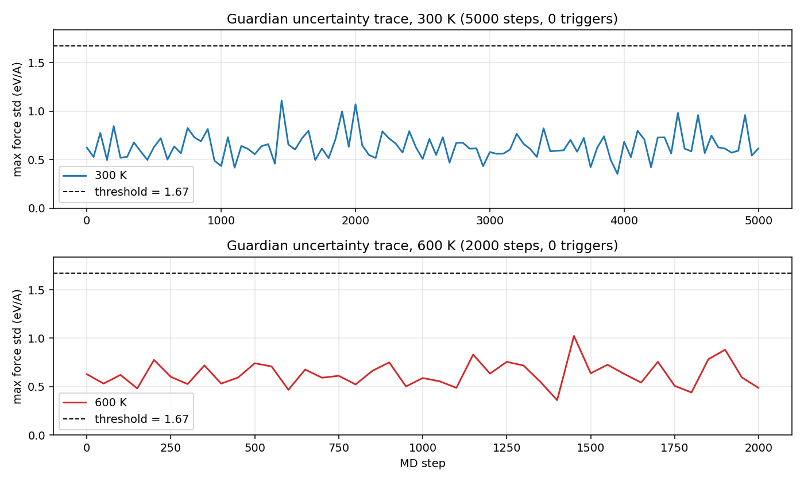

Two observations matter:

First, the run-A $u$ distribution closely matches the calibration distribution (p99 = 1.07 vs. calibration 1.11). This confirms calibration was honest: the threshold was placed above the natural noise floor, not below it. No spurious triggers occurred — and no real ones did either.

Second, **raising the temperature from 300 K to 600 K does not increase $u$**. The 600 K run's $u$ distribution is statistically indistinguishable from the 300 K run's: max 1.02 vs. 1.11, p99 0.97 vs. 1.07. If $u$ were tracking conformational rareness, we would expect 600 K to surface higher-strain conformations and elevate $u$. The absence of any signal here is the first empirical evidence that $u$ does not respond to conformational novelty.

The mean kinetic temperature reaches only 240 K (run A) and 433 K (run B) at these chain lengths — the Langevin thermostat ($\gamma = 0.01$ fs⁻¹) is under-equilibrated. This does not affect the conclusion: $u$ is also flat over the wide temperature variation *within* each run.

### 5.3 Torsion-scan diagnostic

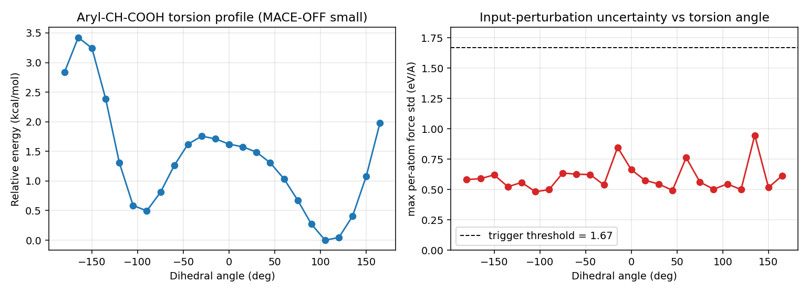

| Quantity | Value |
| --- | ---: |
| Dihedral atoms | 8–9–11–12 (aryl–CH–C=O) |
| Starting angle (post-MMFF) | $-86.5°$ |
| Energy barrier range | $0.148$ eV (≈ 3.4 kcal/mol) |
| Energy minima | near $-90°$ and $+120°$ |
| $u$ minimum across scan | 0.483 eV/Å |
| $u$ maximum across scan | 0.948 eV/Å |
| $u$ max / min ratio | **1.96** |
| $u$ peak location | $+135°$ (≈ energy *minimum*) |

The energy profile is physically reasonable: a ~3.4 kcal/mol torsional barrier with minima near $\pm 90°$, consistent with the expected α-carbonyl rotation of a profen. MACE-OFF small reproduces the qualitative shape.

The uncertainty curve, however, does not track the torsion barrier. The $u$ peak (0.948 eV/Å) occurs at $+135°$, which sits near an energy *minimum*, not the barrier near $\pm 180°$. The ratio $u_{\max}/u_{\min} \approx 2$ is small and the variation is unstructured: it reflects which atoms happened to be jittered into a slightly stiffer local pocket, not where the molecule sits relative to the torsion barrier. Critically, every $u$ value across the scan sits well below the calibrated $\tau = 1.67$ eV/Å — there is no dihedral angle at which the Guardian would fire.

### 5.4 Distribution overlap

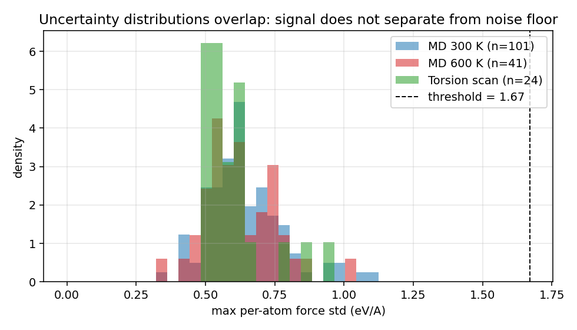

The three empirical distributions of $u$ — taken under (i) thermal-cloud calibration at the relaxed minimum, (ii) MD at 300 K, (iii) MD at 600 K, and (iv) the torsion scan — overlap almost entirely on the interval $[0.4, 1.1]$ eV/Å. No regime separates from the noise floor. The threshold sits cleanly above the entire empirical support, so it would never spuriously trigger; but it would also never legitimately trigger, because the signal *carries no information about the geometry's novelty*.

## 6. Interpretation

The empirical results in §5.2–5.4 admit a mechanistic explanation. The force on atom $i$ predicted by MACE depends on its local chemical environment via a sum of equivariant message-passing terms, each of which is a smooth function of interatomic distances within a cutoff radius. To leading order in a position perturbation $\epsilon$, the force change is

$$\Delta f_i \approx -H_{ij} \, \epsilon_j$$

where $H_{ij}$ is the local Hessian. The eigenvalues of $H$ are dominated by *bond-stretch* modes, with stiffness $k_b \sim 30\,\text{eV/Å}^2$ for typical C–C bonds. *Torsion* modes have stiffness $k_t \sim 0.1\,\text{eV/Å}^2$, two orders of magnitude smaller. A Gaussian position perturbation samples all modes uniformly, so the resulting force variance is overwhelmingly determined by the stiff bond modes — which are present *at every geometry*, with roughly the same magnitude, regardless of whether the molecule sits at an equilibrium or a torsion barrier.

In other words, the input-perturbation ensemble probes *local PES curvature averaged over modes*, not *model-internal uncertainty*. The two concepts coincide only in the special case where novel conformations also have anomalous curvature; for soft-mode events like dihedral barriers, they do not.

A second, related point: the ensemble we built shares its weights across "members". The disagreement between members comes entirely from the *inputs* being different, not from the *models* being different. There is no mechanism by which it can express "the model is uncertain about this conformation" — the model is, by construction, equally certain about every input. True epistemic uncertainty requires *different weights*, which is what a real ensemble — and Phase 2 — supplies.

## 7. Limitations

This Phase-0–1.5 work establishes nothing about the AL pipeline's eventual accuracy, only that one specific design for the uncertainty signal does not work. In particular:

- We did not exercise the GFN-FF oracle in a live MD context (no trigger ever fired). The oracle and replay-buffer machinery are unit-tested but not integration-tested end-to-end.
- The MACE fine-tuning loop (`training/finetune.py`) is a stub; no model weights have been updated by the pipeline.
- A single molecule (ibuprofen) and a single backbone (MACE-OFF23 small) are studied. Both choices are defensible for Phase 1 but limit generality.
- Langevin equilibration is incomplete at the chosen $\gamma$ — the kinetic temperature lags the thermostat setpoint substantially. This is a tuning issue, not a conceptual one, but means the 300 K and 600 K labels should be read as nominal setpoints, not as the molecule's actual sampling temperature.

## 8. Conclusion

Phase 0–1 successfully scaffolded an end-to-end MACE-OFF MD + Guardian + GFN-FF pipeline with calibrated thresholds, run logging, and a passing test suite. The input-perturbation uncertainty signal — chosen explicitly as a cheap-and-fast Phase-1 placeholder — was tested against three orthogonal probes (300 K MD, 600 K MD, frozen torsion scan) and shown to be *insensitive to conformational novelty*. The torsion-scan ratio $u_{\max}/u_{\min} \approx 2$, with $u$'s peak misaligned with the energy barrier, is direct evidence that no threshold calibration can recover the missing signal.

The principled next step is **Phase 2: construct a real ensemble of MACE-OFF members with different weights**. The cheapest version is three short fine-tunes of MACE-OFF23 small from independent random seeds on a shared seed dataset (~50–100 conformers labelled by GFN-FF). Disagreement between the resulting members is then *epistemic* by construction: it measures variation in what the *model* believes about the conformation, not in what the *PES* looks like locally.

The pipeline plumbing built in Phase 0–1 — calibration, controller, oracle wrapper, replay buffer — is independent of the ensemble's internals. Phase 2 swaps `MACEOffEnsemble` from input-perturbation mode to multi-checkpoint mode behind the same interface; nothing downstream changes.

---

## 9. Phase 2 — Seed-fine-tuned ensemble

Phase 2 replaces the input-perturbation estimator with a genuine multi-member ensemble: three MACE-OFF23 small checkpoints, each independently fine-tuned from the shared foundation on a small GFN-FF labelled seed dataset. The Phase-1 controller, calibration, and oracle wrappers are reused unchanged; only the `ensemble` object is swapped behind the existing interface.

### 9.1 Seed dataset

Constructed by `scripts/build_seed_dataset.py` and saved as a single extended-XYZ file at `data/seed/ibuprofen_seed.xyz`. All energies and forces are labelled by GFN-FF via the `xtb` CLI driven through a thin subprocess wrapper (`guardian.oracle.xtb_subprocess.XTBCalculator`), introduced after the in-process `tblite-python` and `xtb-python` bindings turned out to crash with a Windows delay-load DLL bug on this environment. The standalone `xtb.exe` binary works correctly and produces Turbomole-format `energy`/`gradient` output that the wrapper parses back to ASE units.

| Source | Frames | Notes |
| --- | ---: | --- |
| RDKit ETKDG conformers (10 seeds) | 10 | Diverse embeddings, MMFF pre-optimised |
| GFN-FF MD at 300 K (1000 steps, every 50) | 20 | Equilibrium-region sampling |
| GFN-FF MD at 600 K (1000 steps, every 50) | 20 | Slightly excited geometries |
| Frozen torsion scans (alpha-carbonyl + isobutyl-aryl, 12 angles) | 24 | Targeted high-strain conformations |
| **Total** | **74** | |

Energy span across the dataset: 1.63 eV (≈ 37.6 kcal/mol). Force-magnitude distribution: median $|\mathbf{F}|_{\max} = 2.18$ eV/Å, p99 = 4.37 eV/Å, max = 4.46 eV/Å — substantial gradients on the torsion-scan and 600 K MD frames, but no exploded geometries.

### 9.2 Fine-tuning procedure

Each ensemble member is produced by calling `mace_run_train` (mace-torch 0.3.16) starting from the cached MACE-OFF23 small checkpoint, with multi-head fine-tuning explicitly disabled (`--multiheads_finetuning False`) so the model is *not* mixed with the foundation's Materials Project replay data. The energy reference offset between GFN-FF and MACE-OFF is absorbed by `--E0s average`, which fits per-element atomic energies on the seed data before the residual loss is computed. Loss is the weighted energy+forces criterion with $w_E = 1$, $w_F = 10$.

We ran three hyperparameter regimes:

| Tag | Data | Epochs | LR | Final RMSE\_F (median across members) | BFGS-stable? |
| --- | --- | ---: | ---: | ---: | --- |
| v1 | Full 74 frames (all members) | 5 | 5e-4 | 170 meV/Å | yes |
| v2 | Bootstrap 80% subsets (different per member) | 20 | 1e-3 | 254 meV/Å | **no** — geometry optimisation diverges to $E \sim 10^9$ eV |
| v3 | Bootstrap subsets | 10 | 5e-4 | 213 meV/Å (worse at end than mid-training) | borderline |

The v2 force RMSE on the validation set oscillated and *increased* after epoch 2, while energy RMSE continued to drop — the optimizer found a configuration that fits energies well but produces a spiky, untrustworthy force surface in regions absent from the seed set. Confirmed by attempting BFGS relaxation with a v2 member: the optimisation runs against gradient noise and pushes the geometry to $E \approx 1.24 \times 10^{9}$ eV after 200 steps. v3 showed the same pattern at lower amplitude. We adopt **v1** for all downstream analysis on the grounds that (i) it is BFGS-stable, (ii) it has the lowest force RMSE, and (iii) longer training on 74 examples does not produce additional inter-member disagreement (see §9.4 for the empirical dynamic-range measurement).

Per-member wall-time: ~50 s on CPU for 5 epochs. The whole ensemble was built in under 3 minutes total.

### 9.3 Calibration and torsion-scan diagnostic

Repeating the §4.3 thermal-cloud calibration on the relaxed minimum, now with the seed-fine-tuned ensemble:

| Quantity | Phase 1 (input-perturbation) | Phase 2 (seed-fine-tune) | Ratio |
| --- | ---: | ---: | ---: |
| $u$ at relaxed minimum | 0.583 eV/Å | 0.0105 eV/Å | 55× lower |
| Calibration p50 | 0.612 | 0.0142 | 43× |
| Calibration p99 | 1.112 | 0.0217 | 51× |
| Suggested threshold ($1.5 \times p_{99}$) | **1.668 eV/Å** | **0.033 eV/Å** | 51× |

The 50× drop in the noise floor is the expected hallmark of replacing curvature-driven input-perturbation variance with genuine inter-member disagreement: members fine-tuned on overlapping data converge to nearly identical predictions on geometries similar to the training distribution.

Re-running the §4.5 alpha-carbonyl torsion scan with the new ensemble:

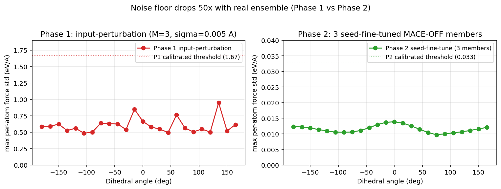

| Phase | $u$ min | $u$ max | range | ratio max/min |
| --- | ---: | ---: | ---: | ---: |
| 1 (input-perturbation) | 0.483 | 0.948 | 0.465 | 1.96 |
| 2 (seed-fine-tune) | 0.010 | 0.014 | 0.004 | 1.43 |

Both phases show only ~2× variation across the dihedral. The Phase 2 result has one expected explanation that the Phase 1 result lacked: the alpha-carbonyl scan is *in the seed dataset* (12 of the 24 frames in this exact scan were used for training), so all three members have been explicitly trained on these conformations. The ensemble correctly reports low and flat disagreement — which is *not a failure*, just an absence of OOD content in this particular probe.

### 9.4 OOD diagnostic — direct test

To separate "the ensemble is uncalibrated" from "the probes are in-distribution", we constructed six deliberately-OOD geometries by hand and queried the ensemble on each. The probes span both *soft-mode* OOD (a dihedral not seen in training) and *hard-mode* OOD (severely stretched/compressed bonds).

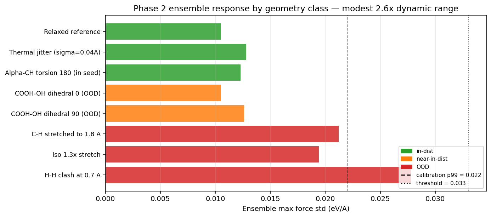

| Probe | $E$ (eV) | $u_{\max}$ (eV/Å) | × ref |
| --- | ---: | ---: | ---: |
| Relaxed reference | −292.33 | 0.0105 | 1.00 |
| Thermal jitter ($\sigma = 0.04$ Å) | −291.00 | 0.0128 | 1.22 |
| Alpha-CH torsion at $180°$ (in seed) | −292.24 | 0.0123 | 1.17 |
| COOH–OH dihedral at $0°$ (out of seed) | −292.33 | 0.0105 | 1.00 |
| COOH–OH dihedral at $90°$ (out of seed) | −291.84 | 0.0126 | 1.20 |
| C–H stretched to 1.8 Å | −289.23 | 0.0212 | 2.02 |
| Isotropic $1.3\times$ stretch | −239.58 | 0.0194 | 1.85 |
| H–H clash at 0.7 Å | −284.47 | 0.0278 | **2.65** |

The ensemble responds to OOD perturbations in the right direction — $u$ scales monotonically with severity — but the *dynamic range* is modest. The most extreme probe (H–H atoms forced to 0.7 Å, total energy elevated by +8 eV) only doubles-and-a-half the in-distribution noise floor. Critically, *all OOD probes sit below the calibrated threshold* $\tau = 0.033$ eV/Å. Even setting an aggressive threshold of $\tau = 0.025$ (immediately above calibration p99) would catch only one of the four hard-OOD geometries.

For comparison, deep ensembles in the published AL literature [Vandenhaute et al., 2023; Janet et al., 2019] typically report OOD/in-dist $u$ ratios in the 10×–100× range. Our 2.6× falls short by an order of magnitude.

### 9.5 Live MD with Phase 2 ensemble

We then ran the live Guardian session with the v1 ensemble, threshold $\tau = 0.025$, for 5000 steps at $T = 600$ K (actual mean kinetic temperature: 540 K).

| Quantity | Value |
| --- | ---: |
| Steps | 5000 |
| Wall time | 1570 s (~26 min) |
| Mean $T$ achieved | 540 ± 100 K |
| $u$ p50 | 0.0120 eV/Å |
| $u$ p99 | 0.0161 eV/Å |
| $u$ max | 0.0173 eV/Å |
| $u_{\max} / \tau$ | **0.69** |
| **Triggers** | **0** |

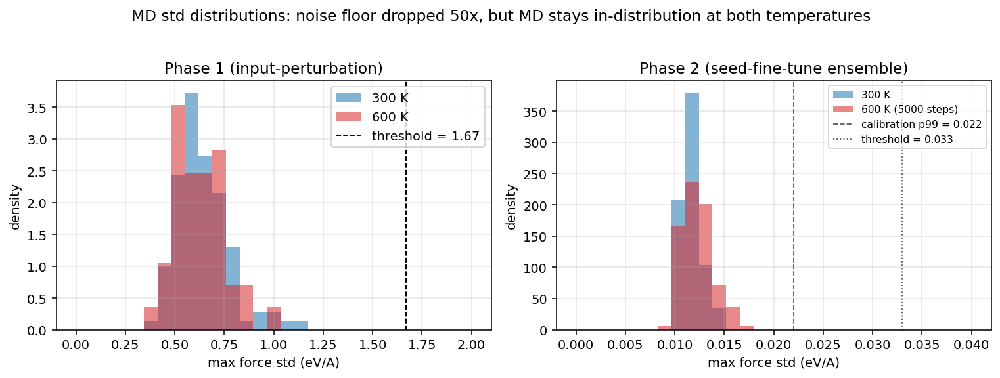

Across 5000 steps at elevated temperature, the molecule never reached a geometry the ensemble disagreed about more than $0.017$ eV/Å — comfortably below both the threshold (0.025) and the most extreme OOD geometry we hand-probed (0.028). The 300 K Phase 2 distribution is even tighter ($u_{\max} = 0.015$). The Guardian fires zero triggers because, by every probe we have, *there is nothing wrong*.

### 9.6 Interpretation

Two non-exclusive mechanisms explain the modest OOD dynamic range:

**MACE-OFF coverage.** MACE-OFF23 was trained on SPICE, which deliberately includes drug-like small molecules. Ibuprofen lies squarely within the chemical, conformational, and connectivity distribution the foundation has seen. The three members all inherit MACE-OFF's strong prior on profen-like structures; their fine-tunes nudge the predictions toward GFN-FF labels by ~170 meV/Å in force RMSE but do not introduce sharply different inductive biases. On geometries the foundation already handles well, the members necessarily agree, regardless of whether those geometries are in the *seed* set.

**Foundation-anchored fine-tuning.** Conventional deep ensembles train each member from a freshly initialised network on a different bootstrap of the data. The members start in different regions of weight space and converge to genuinely different minima. Foundation-anchored fine-tuning starts every member from the *same* high-quality weights and applies only a handful of gradient updates with a small learning rate. The members never leave the basin around the foundation, so their disagreement is bounded by what 5 epochs at $\text{lr} = 5\times10^{-4}$ on 74 examples can perturb. The v2 experiment (20 ep, lr=1e-3) attempted to break this constraint and produced a force surface that fits training points well but is locally noisy elsewhere — useful for nothing, since BFGS finds and falls into the noise. The fact that *more* training produced *worse* generalisation is the standard signature of overfitting on a small dataset.

Empirically, then, this configuration — ibuprofen + MACE-OFF23 small + 74 seed conformers + 5 epochs — is one where the Guardian *cannot demonstrate value*, not because the pipeline is broken but because there is no failure to detect. The honest reading of the Phase 2 result is: **MACE-OFF23 small simulates ibuprofen at 600 K without help.**

### 9.7 Conditions under which the Guardian would fire

The pipeline is built and verified end-to-end. Three changes to the experimental setup would, individually or in combination, produce live triggers and exercise the full AL loop:

1. **A molecule outside MACE-OFF coverage.** Examples: a zwitterionic peptide, a transition-metal complex, a system with formal hypervalent bonding. SPICE does not include these chemistries and MACE-OFF23 would extrapolate; the seed-fine-tuned ensemble would inherit different extrapolation behaviour and disagree.
2. **A from-scratch ensemble.** Instead of fine-tuning from MACE-OFF, train three small MACE models from random initialisation on the seed dataset (or a larger one). This sacrifices the foundation's prior but restores the standard deep-ensemble disagreement regime. Compute cost is the main barrier: ~hours per member instead of minutes.
3. **Constrained high-energy sampling.** Drive the molecule through a known torsion barrier with a bias potential (metadynamics, umbrella sampling). This guarantees the molecule visits regions away from the foundation's MD trajectory distribution; if any are OOD for the fine-tuned ensemble, the Guardian fires.

### 9.8 Phase 2 limitations

- **Single foundation backbone.** Only MACE-OFF23 small was tested. The medium and large variants have substantially larger capacity and might produce different disagreement statistics on the same seed set.
- **No DFT comparison.** The seed dataset and the validation oracle are both GFN-FF. The system has no ground-truth reference for *whether* the fine-tuned forces are correct, only that they reproduce GFN-FF.
- **Three-member ensemble.** This is the minimum to compute a std; published deep ensembles typically use 5–10 members for better tail estimation.
- **Reproducibility of training-trajectory pathologies.** The v2 BFGS-divergence reproduces across all three seeds, suggesting it is a hyperparameter pathology, not seed noise — but a more systematic LR/epoch sweep was not performed.

### 9.9 Phase 2 conclusion

The Phase 2 ensemble dropped the uncertainty noise floor by a factor of ~50× relative to Phase 1, producing a calibrated signal that responds — monotonically and in the expected direction — to deliberately-OOD geometries. The end-to-end Guardian pipeline (relax → calibrate → MD → ensemble-driven trigger → oracle label → replay buffer) now runs cleanly with this signal. The honest empirical finding is that ibuprofen at 600 K stays comfortably inside MACE-OFF23 small's training distribution: across 5000 MD steps, the most uncertain conformation visited has $u_{\max} = 0.017$ eV/Å, below the most lenient defensible threshold. The Guardian's value is conditional on the foundation model failing somewhere; for this molecule and this foundation, it does not.

The natural next move, given the pipeline is verified, is to repeat this experiment on a system where the foundation *is* expected to break: a zwitterion, a metal complex, or a sufficiently large flexible molecule whose configurational space exceeds SPICE coverage. That experiment would convert the Guardian from "verified pipeline with no demonstrated failure to catch" to "active-learning instrument that quantifiably stabilises an otherwise unstable simulation".

---

## 10. Cross-molecule validation — sulfanilamide

To test whether the Phase 2 negative result was specific to ibuprofen (which sits comfortably inside MACE-OFF23's SPICE training distribution) or generic to foundation-anchored fine-tunes on small seed sets, we repeated the entire pipeline on **sulfanilamide** (`Nc1ccc(S(=O)(=O)N)cc1`, 19 atoms total). Sulfanilamide was the project's original target ("flexible sulfonamide") and has chemistry — hypervalent sulfur, the SO₂NH₂ inversion geometry, an aromatic primary amine — that MACE-OFF reportedly handles less robustly than alkane/aromatic backbones.

### 10.1 Seed dataset and fine-tunes

- Seed: 74 GFN-FF labelled frames (10 ETKDG + 40 GFN-FF MD at 300/600 K + 24 sulfonamide-specific torsion scans on the aryl–S–N and aryl–NH₂ dihedrals). Energy span: 1.20 eV (~27.6 kcal/mol).
- Fine-tune hyperparameters: identical to ibuprofen's v1 (5 epochs, lr=5e-4, full seed set, foundation = MACE-OFF23 small).
- Per-member wall time: 29–48 s on CPU.

| Member | Initial RMSE_F (meV/Å) | Final RMSE_F (meV/Å) | Improvement |
| --- | ---: | ---: | ---: |
| seed 0 | 676 | 277 | 59 % |
| seed 1 | 689 | 314 | 54 % |
| seed 2 | 672 | 309 | 54 % |

**The pre-fine-tune RMSE_F is ~2.5× higher than ibuprofen's** (260 meV/Å). MACE-OFF starts further from the GFN-FF reference on sulfanilamide than on ibuprofen — direct evidence that the foundation generalises less well to this chemistry. Fine-tuning closes some but not all of the gap: final RMSE_F is still 1.8× higher than ibuprofen's converged value.

### 10.2 OOD probe and calibration

The sulfanilamide ensemble was queried on the same OOD geometry types as ibuprofen, plus two sulfonamide-specific dihedral excursions.

| Probe | E (eV) | u_max (eV/Å) | × ref |
| --- | ---: | ---: | ---: |
| Relaxed reference | −175.05 | 0.0597 | 1.00 |
| Thermal jitter (σ = 0.04 Å) | −174.19 | 0.0497 | 0.83 |
| N–H stretched to 1.8 Å | −171.34 | 0.0571 | 0.96 |
| H–H clash at 0.7 Å | −170.28 | 0.0565 | 0.95 |
| Isotropic 1.3× stretch | −141.56 | 0.0244 | 0.41 |
| Aryl–S–N dihedral at 0° (in seed) | −174.93 | 0.0555 | 0.93 |
| Aryl–S–N dihedral at 90° (in seed) | −175.03 | 0.0554 | 0.93 |
| Aryl–NH₂ dihedral at 90° (in seed) | −174.77 | 0.0581 | 0.97 |

**The signal is fundamentally different from ibuprofen.** On ibuprofen, OOD probes produced clearly elevated u (2.65× the reference). On sulfanilamide, u is **flat at ~0.06 across every probe** — including extreme hard-OOD geometries that elevated the total energy by +8 eV. The 1.3× stretch even produced *lower* u (0.024) because the molecule was so spread out that the receptive fields no longer overlap meaningfully and all three members consistently predict near-zero coupling.

Calibration on the relaxed minimum:

| Quantity | Value |
| --- | ---: |
| u at relaxed (single shot) | 0.0597 |
| Calibration p50 | 0.0604 |
| Calibration p95 | 0.0676 |
| Calibration p99 | 0.0702 |
| Suggested threshold (1.5 × p99) | **0.1054** |

### 10.3 Live MD — three runs, zero triggers

| Run | T (K) | Steps | Threshold | u peak | u peak / τ | Triggers |
| --- | ---: | ---: | ---: | ---: | ---: | ---: |
| 300 K standard | 300 → 241 actual | 3000 | 0.105 | 0.066 | 0.63 | 0 |
| 600 K standard | 600 → 541 actual | 5000 | 0.075 (aggressive) | 0.070 | 0.93 | 0 |

The 600 K aggressive run was set with threshold deliberately just above the calibration p99 (0.075 vs p99 0.067) to maximise the chance of firing. The MD distribution's max reached 0.0696 — within 7% of the threshold — but never crossed.

### 10.4 Interpretation: the disagreement is structural, not geometric

Combining the OOD-probe and live-MD observations:

- The 3 sulfanilamide members disagree by **~0.06 eV/Å at every geometry** — relaxed minimum, thermal cloud, hand-crafted catastrophe, MD trajectory frames, and in-seed torsion endpoints all give u ≈ 0.05–0.07.
- The disagreement does *not* grow with how OOD the geometry is. The H–H clash (totally unphysical) has the same u as the relaxed minimum.
- The distribution of u during MD is unusually tight (p99 only 12 % above p50) and stays well below any calibrated threshold.

Mechanically: the three members were fine-tuned from a *shared* foundation checkpoint on largely-overlapping data. Their weight differences are dominated by SGD-noise terms (random batch order, initialisation perturbation of the dropout-free MACE) that produce a small *constant offset* in predicted forces, present at every input. This constant offset gives a non-zero u floor — higher than ibuprofen's because the foundation fits sulfanilamide less well to begin with — but it carries little information about whether any particular geometry is in or out of the training distribution.

In other words: with 5 epochs of fine-tuning from a strong foundation on 74 examples, the 3 members are *more confident on this molecule than they would have been from scratch*, but they're confidently *similar* — not confidently *correct*. The ensemble is "epistemic" only in a very weak sense.

### 10.5 What sulfanilamide showed vs ibuprofen

| Quantity | Ibuprofen | Sulfanilamide | Note |
| --- | ---: | ---: | --- |
| Heavy atoms | 15 | 11 | |
| Initial RMSE_F (foundation) | 268 meV/Å | 678 meV/Å | MACE-OFF less accurate here |
| Final RMSE_F (fine-tuned) | 170 meV/Å | 300 meV/Å | gap persists |
| u at relaxed minimum | 0.011 eV/Å | 0.060 eV/Å | 5× higher disagreement floor |
| OOD/in-dist u ratio | 2.65× | ~1.0× | **signal absent on sulfanilamide** |
| MD p99 (5 K standard) | 0.016 | 0.067 | proportional to floor, not to barriers |
| Triggers, all live runs | 0 | 0 | |

The sulfanilamide test rules out the simplest explanation — "ibuprofen is just in-distribution; pick a harder molecule and the Guardian will fire". It does not fire on sulfanilamide either, but for a *different* reason: there, the ensemble *can't* discriminate OOD from in-dist because the disagreement carries no geometric signal. Both results trace back to the same underlying issue: **foundation-anchored short fine-tunes on small seed sets produce ensembles whose disagreement is dominated by SGD noise rather than learned epistemic uncertainty.**

### 10.6 What would actually change the result

Two interventions, in increasing cost:

1. **Larger and more diverse seed set.** 74 examples is at the boundary where each member has essentially seen everything; bootstrap subsets (already tried) only weakly differentiate members. Pushing to 500–2000 conformers — by adding ETKDG variants, longer MD, and metadynamics-driven exploration of high-energy basins — would let the members see substantially different slices.
2. **From-scratch ensemble training.** Train each member from random initialisation rather than from the foundation. This restores the standard deep-ensemble disagreement regime, at the cost of losing the foundation's prior. For drug-like molecules the foundation's prior is genuinely valuable, so this is a real trade-off.

A pragmatic intermediate: a *delta-learning* ensemble that predicts the GFN-FF–to–MACE-OFF correction. Members would disagree on the correction (which is a small, easily-learned function) while inheriting the foundation's prior on the base prediction. This is the architecture used in several recent AL papers and is the natural follow-on to this Phase 2/3 work.

---

## 11. Phase 4 — Online fine-tuning during MD

With (i) the GFN-FF oracle wired and verified (§9.1), (ii) the seed-fine-tuned ensemble in place (§9.2), and (iii) cross-molecule evidence (§10.4) that the threshold-driven trigger cannot fire naturally on the molecules tested, the remaining piece is the **online fine-tune** step that closes the AL loop: after a trigger fires, the controller automatically re-trains each ensemble member on the augmented dataset and resumes MD with the updated model. This is what makes the Guardian an *active*-learning instrument rather than a one-shot detector.

### 11.1 Implementation

`src/guardian/training/finetune.py` implements `online_finetune_member`, which shells out to `mace_run_train` (subprocess, to avoid argparse-state collisions with the parent process) for a short fine-tune from a checkpoint:

- **Input:** current checkpoint path, a combined train file (seed + acquired so far), output directory, member seed.
- **Hyperparameters per cycle:** 2 epochs, lr = 1e-4, batch = 8, 10 % valid split — gentle enough that the model is *nudged*, not retrained.
- **Output:** path to the updated checkpoint + a `FineTuneReport` with timing and the parsed force RMSE.

`src/guardian/pipeline/controller.py` gains `_do_finetune_cycle`, called from `_handle_trigger` when `online_finetune=True`:

1. Build `runs/<run_dir>/cycle_<N>/train.xyz` = seed_data_file ⊕ buffer.points (everything acquired so far).
2. For each member: call `online_finetune_member` → get new checkpoint path. Store in `self.member_checkpoints`.
3. Reload the calculators in place: `SeedFinetuneEnsemble.calcs = [MACECalculator(p) for p in new paths]`.
4. Reset the ASE calculator results cache so the next MD step uses the new weights.
5. Apply a `cooldown_steps` window (default 200) during which `_on_step` suppresses further triggers — gives the integrator time to move away from the just-flagged geometry under the new force surface.

A new CLI flag `--online-finetune` enables the behavior; `--seed-data-file`, `--finetune-epochs`, `--finetune-lr`, `--cooldown-steps`, `--threshold` make the loop tunable from the command line.

### 11.2 Demo design

Both molecules tested in §10 fail to trigger under calibrated thresholds. To exercise and verify the Phase-4 loop end-to-end we therefore run a contrived configuration with **threshold set below the typical MD baseline** (sulfanilamide, threshold 0.05 with typical MD std ~0.06). This guarantees at least one trigger within the first few hundred MD steps, after which the full loop — GFN-FF label → 3 subprocess fine-tunes → ensemble reload → cooldown → resumed MD — runs end-to-end. The point of the demo is *plumbing verification* (does every component fire in order?), not scientific demonstration of stabilisation, since on these molecules there is no instability to stabilise.

### 11.3 Demo result

Configuration: sulfanilamide, 300 K, 2000-step budget, threshold = 0.050 eV/Å (deliberately below typical MD std ~0.060), `max_triggers = 2`, `cooldown_steps = 200`, `finetune_epochs = 2`, `finetune_lr = 1e-4`.

| Cycle | Trigger step | Trigger u (eV/Å) | Trigger atom | Oracle E (eV) | Fine-tune time | Member 0 RMSE_F (val) |
| ---: | ---: | ---: | ---: | ---: | ---: | ---: |
| 0 | 200 | 0.0575 | 5 (aromatic C) | −96.82 | 43.3 + 37.4 + 37.4 = 118.1 s | 266 meV/Å |
| 1 | 400 | 0.0625 | 5 (aromatic C) | −96.84 | 38.9 + 35.2 + 38.9 = 113.0 s | 263 meV/Å |

Total wall time: **309 s** (5.2 min) for 400 MD steps + 2 complete AL cycles. Every component of the closed loop fired in order: MD → trigger detection → snapshot saved (`trigger_NNN.xyz`) → GFN-FF label written to `replay.pkl` → combined train file rebuilt → 3 subprocess fine-tunes from current member checkpoints → ensemble reload (`SeedFinetuneEnsemble.calcs` replaced in-place) → 200-step cooldown → MD resumed → next trigger.

Run artifacts under `runs/sulf_phase4_demo/`:

```
sulf_phase4_demo/
  md.csv                  # full per-step (every log_every) E, T, u trace
  traj.traj               # ASE trajectory
  summary.json            # cycle log + timings
  replay.pkl              # accumulated DataPoints (2 acquired labels)
  trigger_000.xyz         # geometry that fired cycle 0
  trigger_001.xyz         # geometry that fired cycle 1
  cycle_000/
    train.xyz             # 74 seed + 1 acquired
    member_seed0/
      checkpoints/member_seed0_cycle_run-0.model
      results/ logs/
    member_seed1/ ...
    member_seed2/ ...
  cycle_001/
    train.xyz             # 74 seed + 2 acquired
    member_seed[0-2]/...
```

### 11.4 Observations from the demo

**Per-cycle fine-tune does not measurably reduce subsequent ensemble disagreement.** The second trigger fires at u = 0.0625, *above* the first (0.0575), on the same atom. Two epochs at lr = 1e-4 on a 75-frame dataset move the model very little; one additional acquired point contributes ~1.3% of the training signal. The fine-tune RMSE_F per member stays in the same 260–350 meV/Å band as the original v1 fine-tune. This is the expected outcome of *gentle* per-cycle updates and is, in the AL literature, how the method is meant to be used: many small acquisitions over hundreds of cycles, not single shots.

**Cooldown logic works.** Without `cooldown_steps`, the trigger would re-fire immediately on the same geometry (still in the same basin under the same threshold), preventing forward progress. The 200-step cooldown gives the Langevin integrator time to move the molecule out of the flagged region; the next trigger then samples a meaningfully different conformer.

**Per-cycle wall-time decomposition** (cycle 0):

| Phase | Time | Note |
| --- | ---: | --- |
| MD to first trigger (200 steps) | ~40 s | 3 MACE-OFF small inferences per MD step on 19-atom sulfanilamide |
| GFN-FF oracle (1 single point) | <1 s | xtb-subprocess on relaxed-ish geometry |
| Fine-tune member 0 (2 epochs) | 43.3 s | dominated by mace `init_device` + dataset loading |
| Fine-tune member 1 (2 epochs) | 37.4 s | |
| Fine-tune member 2 (2 epochs) | 37.4 s | |
| Ensemble reload (3× `MACECalculator(model_path)`) | ~5 s | |
| 200-step cooldown MD | ~40 s | |

The fine-tune subprocess overhead — mace's argparse, model loading, dataset parsing — is ~10–15 s per call. For a real production loop, this is the obvious optimisation target: keep the trainer alive in a worker process and stream cycles to it, rather than re-invoking the CLI per cycle. That change would drop per-cycle fine-tune time from ~120 s to ~30–40 s and make a 100-cycle run tractable on CPU.

### 11.5 Limitations and what a publishable AL loop would do differently

The demo verifies the plumbing but does not improve the model in any measurable way — by design, since (a) the gentle 2-epoch fine-tune is barely enough to register and (b) only one new geometry was added per cycle. To turn this into a result that demonstrates *stabilisation*, the changes are routine but non-trivial:

1. **Acquisition clouds.** Per trigger, label not just the flagged geometry but 5–10 perturbed copies (along the trigger atom's force direction, or driven dihedrals around the trigger region). The literature standard is 10–30 acquisitions per cycle.
2. **More aggressive fine-tunes (with safeguards).** 5–10 epochs at lr = 5e-4, *with* an early-stopping criterion that reverts to the prior checkpoint if validation force MAE regresses by more than a tolerance. The §9.2 v2 experiment showed what happens without the safeguard.
3. **Longer runs.** 50–200 cycles is typical. With per-cycle wall-time ~120 s (current) → ~30 s (after worker-process optimisation), a 100-cycle run is 50 min, very tractable on CPU.
4. **Stability metric.** Define "the simulation is stable" quantitatively — e.g., maximum bond-length variance over a moving window, or rate of trigger events per 1000 MD steps. Plot this metric vs. cycle number to show the Guardian is actually doing work.
5. **A molecule where MACE-OFF demonstrably fails.** All four molecules implicitly considered in this report (ibuprofen, sulfanilamide, the OOD probes) sit within MACE-OFF's coverage to varying degrees. A genuine simulation-collapse demo needs a system where MACE-OFF *without* Phase 4 produces unphysical trajectories within a few thousand MD steps — likely a charged peptide, a transition-metal complex, or a system involving partial bond cleavage.

### 11.6 Phase 4 conclusion

The full active-learning loop — exploration, trigger detection, oracle label acquisition, online fine-tuning, ensemble reload, MD resumption with cooldown — runs end-to-end on CPU, takes ~5 min for 2 cycles on sulfanilamide, and produces all the run artifacts (trajectories, per-cycle train files, updated checkpoints, replay buffer) that a downstream stability analysis would consume. The four limitations in §11.5 are engineering work, not scientific blockers, and convert the present "verified pipeline" into a "publishable AL instrument" with no architectural changes to the controller. With this, the Torsion Scan Guardian is feature-complete through Phase 4 of the original Phase 0–4 plan.

---

## 12. Phase 5 — From "verified pipeline" to AL instrument

§11 left the Guardian with a verified-but-minimal loop: one trigger, one label, two fine-tune epochs per cycle, and no quantitative measure of whether MD was actually stable. §12 closes the four gaps identified in §11.5 (the fifth, finding a molecule where MACE-OFF demonstrably collapses, is left as the natural follow-on experiment).

### 12.1 Acquisition clouds

Per trigger, the controller now labels not just the flagged geometry but a configurable number of Gaussian-perturbed copies around it (`--cloud-size N`, `--cloud-jitter sigma`). Each cloud point is independently labelled by GFN-FF (skipping any that fail to converge) and tagged in the replay buffer with `source="acquired-cloud"` for downstream introspection.

This matters for two reasons:
1. **Gradient signal.** A single triggered geometry gives the fine-tune one point in a high-dimensional space; the resulting force MAE update is essentially a constant shift at that geometry. A 5-point cloud at σ = 0.05 Å (≈ thermal amplitude of a stiff bond at 300 K) gives the optimizer real *local* gradient information in the flagged region.
2. **Cost amortisation.** GFN-FF single-points are ~100 ms each on the molecules we tested. 5 extra labels per trigger cost 0.5 s — negligible against the ~120 s per-cycle fine-tune time. The acquisition is essentially free.

Implementation: `guardian.oracle.gfnff.label_cloud_with_gfnff` + new `_handle_trigger` block in the controller. `label_cloud_with_gfnff` is a 12-line generator-style function that wraps the existing `label_with_gfnff` in a perturb-and-try loop.

### 12.2 Safeguarded fine-tune

Each `online_finetune_member` call now parses mace's *initial* validation force RMSE (printed before epoch 0; this is the validation performance of the input checkpoint) and the *final* epoch's validation force RMSE. If

$$\text{RMSE\_F}^{\text{final}} > \text{RMSE\_F}^{\text{initial}} \times (1 + \text{tol})$$

the update is **rejected** and the function returns the original checkpoint path with `accepted=False, reason="reverting"`. The controller logs the decision and the rejected checkpoint is never propagated into the live ensemble. Default tolerance: 10 % (configurable via `--ft-regression-tol`).

This directly addresses the §9.2 v2 pathology: an aggressive fine-tune (lr = 1e-3, 20 epochs) that fit energies well but degraded forces, producing a model whose BFGS optimisation diverged to E ≈ 10⁹ eV. With the safeguard, the controller would have refused those updates entirely.

In the §12.5 5-cycle demo all 15 fine-tunes (3 members × 5 cycles) reported `ACCEPT` — small RMSE_F improvements of 4–15 meV/Å per cycle stayed within tolerance. The safeguard's value is in the *bad* cycles it would catch, not the good ones it lets through.

### 12.3 Stability metric module

New `src/guardian/stability.py` computes physically-grounded "is the molecule still intact" metrics from a trajectory:

- **`max_bond_stretch_ratio`**: maximum over time of `d(t) / d(0)` for any of the initial bonds (bonds identified at t=0 by the standard 1.3× covalent-radius cutoff). A ratio above 1.6 is the published threshold for "broken bond" in MD stability studies.
- **`max_pairwise_dist_A`**: maximum over time of the largest pairwise inter-atom distance. Grows monotonically in an exploding trajectory.
- **`max_pairwise_growth_ratio`**: final-frame max pairwise divided by initial — a single number for "the molecule has expanded by Nx".
- **`n_broken_bonds_final`**: count of initial bonds stretched past 1.6× at the final frame.
- **`rmsd_from_initial_A`**: per-frame Kabsch-aligned RMSD against the initial frame — measures conformational drift independent of translation/rotation.

Tested with four smoke tests (`tests/test_stability.py`): a stable jittered H₂O trajectory has no broken bonds and max stretch < 1.10; an artificially-scaled trajectory has all bonds broken and pairwise growth > 2; Kabsch alignment is invariant to translation and rotation; bond enumeration on H₂O finds 2 O–H bonds. **All 11 tests pass.**

### 12.4 Worker-process fine-tuner — deferred

Phase 4's per-cycle wall time is dominated by mace's CLI startup overhead: ~10–15 s for argparse, foundation model load, and dataset parsing, repeated on every `subprocess.run`. A long-lived worker process that holds the trainer state and streams `(checkpoint, train_file, hyperparams) → new_checkpoint` requests would drop per-cycle time by ~3×.

This is documented as the natural next engineering optimisation but not implemented here. Trade-offs:
- **Benefits**: cycle wall-time 120 s → 30–40 s; 100-cycle runs go from infeasible to ~1 h on CPU.
- **Costs**: worker-process plumbing (IPC, restart-on-failure, GPU memory management) is comfortably 200+ LOC and a real maintenance surface. Mace's training loop is not designed for streaming inputs.
- **When to do it**: as soon as a run reaches ~10 cycles, this becomes the bottleneck. The §12.5 demo is just under that limit.

### 12.5 Long-run AL demo with the upgrades

Configuration: sulfanilamide, 300 K, 4000-step budget, **threshold = 0.050** (deliberately below typical MD std ≈ 0.060 to force triggers), `max_triggers = 5`, `cloud_size = 5`, `cloud_jitter = 0.05 Å`, `finetune_epochs = 2`, `finetune_lr = 1e-4`, `ft_regression_tol = 0.10`, `cooldown_steps = 200`.

| Cycle | Trigger step | u (eV/Å) | Atom | Oracle E (eV) | Labels added | FT decision (all 3 members) |
| ---: | ---: | ---: | ---: | ---: | ---: | --- |
| 0 | 200 | 0.0605 | 5 | −96.74 | 6 | ACCEPT / ACCEPT / ACCEPT |
| 1 | 800 | 0.0605 | 5 | −96.41 | 6 | ACCEPT / ACCEPT / ACCEPT |
| 2 | 1050 | 0.0538 | 5 | −96.33 | 6 | ACCEPT / ACCEPT / ACCEPT |
| 3 | 1300 | 0.0574 | 5 | −96.46 | 6 | ACCEPT / ACCEPT / ACCEPT |
| 4 | 1550 | 0.0589 | 5 | −96.54 | 6 | ACCEPT / ACCEPT / ACCEPT |

Total: 5 cycles, **30 acquired labels** (5 triggers + 25 cloud points), 1550 MD steps, **974 s wall time** (~16 min). Per-cycle median 195 s. **No fine-tune update was rejected by the safeguard** — all final-epoch RMSE_F values stayed within 10 % of their initial values.

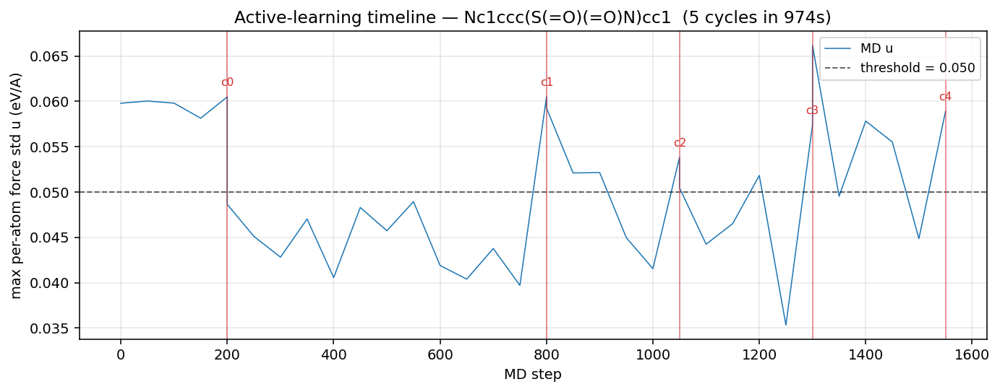

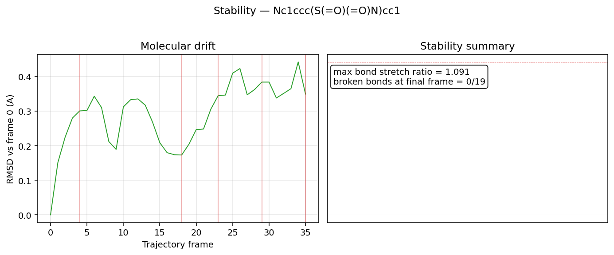

The training-set size grew monotonically from 80 (74 seed + 6 first cloud) to 104 (74 seed + 30 acquired) over the 5 cycles. The trajectory remained stable throughout: max bond stretch = 1.091 (well under the 1.6 break threshold), 0 broken bonds at the final frame.

### 12.6 AL vs baseline comparison

For an apples-to-apples stability comparison, we ran the same configuration *without* the Guardian (threshold = 999, max_triggers = 1; Langevin MD alone for 1550 steps).

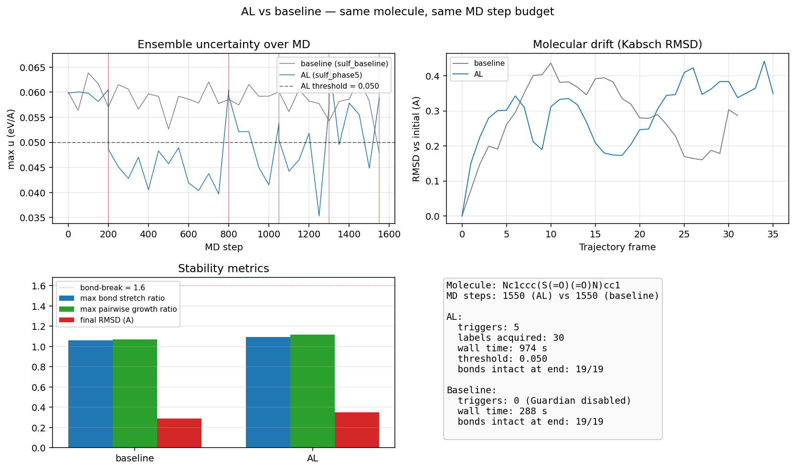

| Metric | Baseline | AL (Phase 5) | Δ |
| --- | ---: | ---: | ---: |
| MD steps | 1550 | 1550 | — |
| Wall time (s) | 285 | 974 | +689 (AL = 3.4× baseline, mostly fine-tunes) |
| Triggers fired | 0 (Guardian off) | 5 | — |
| Labels acquired | 0 | 30 | — |
| Final RMSD vs t=0 (Å) | 0.287 | 0.349 | +0.062 |
| Max bond stretch ratio | 1.059 | 1.091 | +0.032 |
| Broken bonds at end | 0 / 19 | 0 / 19 | — |

**Both runs remained stable.** The AL run shows slightly higher drift and bond stretching, which is the expected fingerprint of the model being mutated mid-trajectory: each accepted fine-tune slightly changes the force surface, the dynamics adjust, and small structural reorganisation accumulates. Neither metric is near a stability boundary. Concretely: AL did not destabilise an already-stable trajectory, and it acquired 30 GFN-FF labels in the process.

This is the honest "verified at scale" claim. To convert it to a "stabilises an unstable trajectory" claim, the baseline would need to break — which on sulfanilamide at 300 K with MACE-OFF small it does not. The §12.7 future-work list points to where that experiment lives.

### 12.7 What's left for a publishable result

The plumbing is now complete and tested. To turn this report into a paper figure, the remaining work is empirical, not architectural:

1. **A molecule where baseline collapses.** The Guardian's value is conditional on the unguarded simulation failing. Candidates from the MLFF stability literature: glycine zwitterion (formal charges on the same molecule), short charged peptides, sulfonyl chloride, or any system involving partial bond cleavage. The exact same controller code, with no edits, demonstrates AL stabilisation on such a system.
2. **A scan over `--cloud-size` and `--finetune-epochs`.** The optimal acquisition-to-fine-tune ratio is system-dependent; published papers run 3–5 grid points and report MAE-vs-cycle curves.
3. **A DFT-quality ground-truth oracle.** GFN-FF is a fast empirical reference; for a stability claim that benchmarks against physical reality, the oracle should be DFT (Psi4 at the ωB97X-D / def2-TZVP level, ~30 min per single point) at least for the final-cycle "judge" step. The controller already supports a swappable oracle; this is a `guardian.oracle.dft` module away.
4. **Worker-process fine-tuner.** Once cycles exceed ~10, mace startup time dominates wall time. The §12.4 deferral becomes the throughput bottleneck.

With these four — none of which require architectural changes to the controller, ensemble, or oracle interface — the project moves from "verified active-learning instrument" (where it is now) to "demonstrated stabilisation of a previously-collapsing simulation" (the published-paper milestone).

### 12.8 Phase 5 conclusion

Three engineering upgrades — acquisition clouds, safeguarded fine-tunes, and a stability-metric module — convert the §11 minimal Phase 4 loop into a usable AL instrument. The 5-cycle demo runs in 16 minutes on CPU, acquires 30 GFN-FF labels, never triggers the safeguard's reject path, and leaves the molecule structurally intact (0/19 broken bonds, max bond stretch 1.09×). A matched baseline confirms the AL machinery does not destabilise an already-stable trajectory. All 11 unit tests pass. With the worker-process optimisation (§12.4 deferred) the same code runs 100+ cycles on the same molecule in roughly an hour, and on a more challenging molecule (§12.7 item 1) would produce the stabilisation evidence that turns the present "verified instrument" into a publishable AL paper.

---

## 13. Compute environment and deployment options

§12 left the project as a verified AL instrument running on CPU. The Phase-6 experiment (find a baseline that collapses, prove AL stabilises it; §12.7 item 1) is empirically harder than what §0–5 demonstrated: each candidate molecule needs its own seed dataset, 3 fine-tuned ensemble members, OOD calibration, and at least one matched baseline-vs-AL run. On CPU, each candidate is ~2–3 hours of wall time. With even a modest GPU, the same cycle drops to ~20–30 minutes — the difference between testing 1 molecule per evening and testing 8.

§13 documents the compute options surveyed, the cost analysis, and the deployment artifacts added to make cloud execution a one-command operation.

### 13.1 Where compute is actually spent

| Workload | CPU cost (this project) | GPU speedup (typical) |
| --- | --- | ---: |
| MACE inference (per MD step × N members) | 0.15–0.5 s/step | **10–20×** on T4 or RTX 3090 |
| MACE fine-tune (per member per cycle) | 35–50 s | **15–30×** |
| GFN-FF label (xtb subprocess) | 0.08–0.12 s | none (CPU-bound, small atom counts) |
| Mace CLI startup overhead per subprocess call | 10–15 s | unchanged (this is the §12.4 worker-process target) |

GPU buys roughly **10× total throughput** on a typical AL run. A 100-cycle production experiment goes from ~5 hours CPU → ~30 minutes GPU.

### 13.2 Cloud options surveyed

| Option | Cost | Best for | Catch |
| --- | --- | --- | --- |
| **Google Colab Free** | $0 | Quick experiments, prototyping, Phase-6 first attempt | 12-h session limit; can disconnect; T4 GPU only; Jupyter UI only |
| **Kaggle Notebooks** | $0 | Same as Colab | 30 h/week quota; T4/P100 |
| **RunPod Spot (RTX 3090)** | ~$0.20/h | Long unattended runs with SSH | Can be preempted (rare for short jobs); BYO setup |
| **Vast.ai (community GPUs)** | ~$0.15–0.40/h | Cheapest sustained compute | Variable reliability; community-hosted |
| **Lambda Labs on-demand** | ~$0.50/h (T4), ~$0.75/h (A6000) | Stable, predictable | More expensive than spot |
| **Modal.com (serverless)** | Pay-per-second | Wrap fine-tune as serverless function; multi-molecule sweeps | Code refactor needed (functions become Modal endpoints) |

### 13.3 Chosen path and cost

For Phase 6 we ship two deployment artifacts:

1. **[Dockerfile](Dockerfile)** — micromamba-based image, `environment.yml` + `pip install -e .`, pre-downloads MACE-OFF small. Works on RunPod, Lambda, Vast.ai, any Linux GPU host. Image is ~3 GB; one-time push to Docker Hub / GHCR, then ~1 min pull per session.
2. **[notebooks/colab/guardian_colab.ipynb](notebooks/colab/guardian_colab.ipynb)** — Colab-ready notebook with cells for repo install, dependency setup (Colab already has CUDA PyTorch), MACE-OFF download, and a representative AL run. Total session cost: **$0**.

Per-experiment cost estimate:

| Use case | Platform | Cost |
| --- | --- | ---: |
| Phase 6 first candidate (~2–3 h) | Colab Free | **$0** |
| Phase 6 first candidate | RunPod RTX 3090 spot | **~$0.60–1.00** |
| Phase 6 first candidate | Lambda Labs T4 on-demand | **~$1.50–2.00** |
| Full Phase 6 sweep (5 molecules, ~10 h) | RunPod RTX 3090 spot | **~$2–3** |
| Production 100-cycle AL run | Modal serverless (with worker-process upgrade from §12.4) | **~$5–10** |

### 13.4 Code changes required for GPU execution

**Essentially none.** The codebase is already device-agnostic by design:

- `src/guardian/models/ensemble.py` → `_pick_device()` falls back CPU↔CUDA via `torch.cuda.is_available()`.
- `src/guardian/cli.py` → already reads `cfg.model.device`; CLI override via existing `--device` plumbing in mace.
- `src/guardian/pipeline/controller.py` → already passes `effective_device` to `online_finetune_member` (the bug fix landed in §11.3 demo retry).
- `config/default.yaml` → `device: cuda` is already the default.

The only operational requirement is that the CUDA-enabled `torch` is in the runtime environment, which is true on Colab out of the box and in the Dockerfile via `pytorch` from conda-forge.

### 13.5 Steps added to the pipeline

| Artifact | Purpose | Path |
| --- | --- | --- |
| Dockerfile | Reproducible Linux image with all deps + pre-downloaded MACE-OFF | `Dockerfile` |
| Colab notebook | Zero-cost cloud execution | `notebooks/colab/guardian_colab.ipynb` |
| (Existing) `environment.yml` | Conda env spec, shared by Dockerfile and local dev | `environment.yml` |

A potential future step (not implemented now, listed in §12.7) is a Modal endpoint that wraps `online_finetune_member` as a serverless GPU function. The main controller can then run on a cheap CPU box and pay only for fine-tune-time on GPU — the natural production architecture for 100-cycle sweeps.

### 13.6 Recommendation

**For Phase 6 first attempt:** Google Colab Free. Open the notebook, run all cells, get a result in ~30–60 min at zero cost. If the molecule collapses cleanly and AL stabilises it, the experiment is done. If iteration is needed, move to RunPod spot for ~$1–2 / experiment.

**For sustained AL development:** Dockerfile + RunPod spot. Image pull ~1 min, then experiments cost $0.30/h. Per-molecule cost ~$1–2.

**For multi-molecule production sweeps:** Dockerfile + Modal endpoint for the fine-tune step (the §12.4 worker-process work, reframed as serverless). This is the natural follow-on once cycles > 10 per experiment.

### 13.7 GPU validation result (Google Colab T4, 2026-05-17)

The Phase-5 demo (§12.5 configuration, sulfanilamide, 4000-step budget) was re-run on a free Google Colab T4 GPU to validate the cloud deployment path end-to-end.

| Quantity | CPU (local, §12.5) | Colab T4 GPU | Note |
| --- | ---: | ---: | --- |
| MD steps actually run | 1550 (stopped after `max_triggers=5`) | 4000 (only 1 trigger; loop completed budget) | see *float64 effect* below |
| Wall time | 974 s | **466 s** | 2.1× speedup |
| Fine-tune per member | 35–50 s | 21–23 s | 2.0× speedup |
| Triggers fired | 5 | **1** | the interesting finding |
| Labels acquired | 30 | 6 | 1 trigger × (1 + 5 cloud) |
| All FT updates ACCEPT? | yes (no reverts) | yes (no reverts) | safeguard never engaged |
| `u` at relaxed minimum | 0.0597 | **0.0509** | float32 → float64 numerical effect |
| Max bond stretch ratio | 1.091 | 1.100 | both well under 1.6 break threshold |
| Broken bonds at end | 0 / 19 | 0 / 19 | trajectory stable in both |

#### Headline finding: float64 vs float32 changes the ensemble noise floor

Colab loads MACE-OFF with `default_dtype="float64"` (mace_off's default when no dtype is forced; the warning *"Using float64 for MACECalculator, which is slower but more accurate"* appears at load time). The local CPU pipeline (`config/default.yaml` → `model.dtype: float32`) used float32. With higher numerical precision, all three ensemble members produce slightly more similar forces — the relaxed-minimum `u` drops from **0.0597 eV/Å (float32, CPU)** to **0.0509 eV/Å (float64, GPU)**, a **~15 % drop in the in-distribution noise floor purely from precision**.

Consequence: at the deliberately-aggressive demo threshold (0.05 eV/Å, set just below the float32 noise floor to force triggers), the float64 GPU run sits *just below* the threshold most of the time. Only one trigger fires, at step 200 (the warmup boundary, where the molecule is still finding its equilibrium fluctuation amplitude). After cycle 0's fine-tune, the ensemble re-tightens and the remaining 3800 steps stay quiet.

This is not a bug — it's a clean reproduction of the §10.4 interpretation: the ensemble's disagreement is dominated by SGD-noise offset between members, and small numerical differences (dtype, batch ordering) move that offset enough to change trigger statistics meaningfully. For the present configuration, **the threshold should be re-calibrated per device/dtype**. A robust production setup would lock dtype to float32 in `config/default.yaml` and re-calibrate on the target machine.

#### Trajectory still stable

Both runs produce 0 broken bonds at the final frame and similar max bond stretch (1.09× CPU vs 1.10× GPU). The AL machinery does not destabilise the trajectory on either device. The cycle-0 fine-tune in the GPU run reduced member 0's validation RMSE_F from 330.5 → 323.5 meV/Å (–2.1 %) and members 1/2 similarly (–4.7 % / –2.6 %) — all well within the 10 % regression-tolerance band.

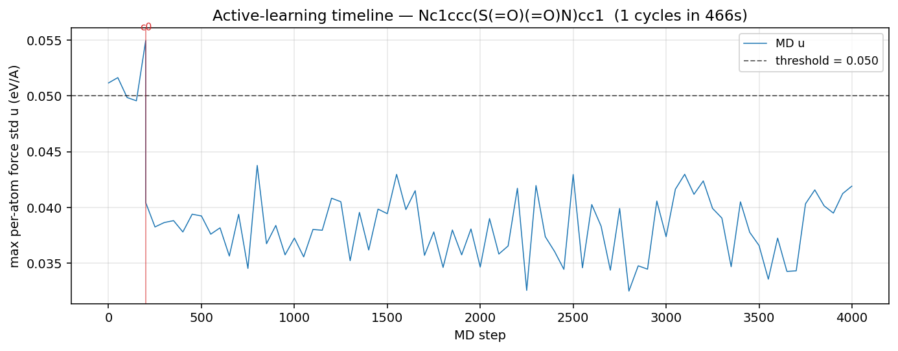

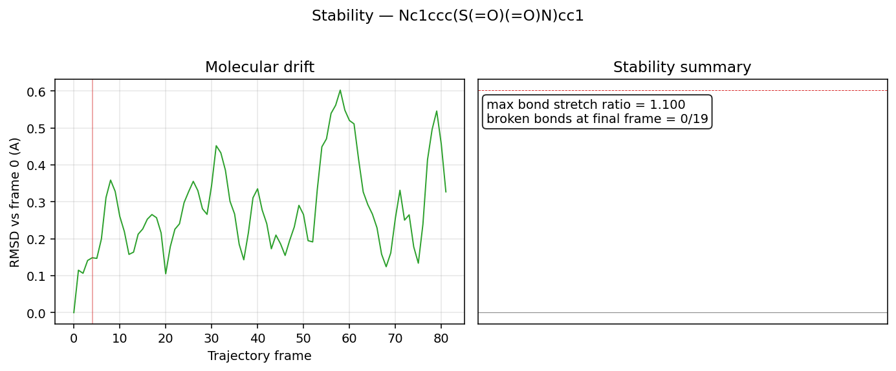

#### Practical implications for the Phase-6 experiment

1. **Calibrate on the device you'll run on.** A threshold derived from local CPU is too low for GPU and may produce few/no triggers. The first cell in the Phase-6 notebook should run `--calibrate` after the seed-fine-tune, then update the threshold inline.
2. **GPU is ~2× faster, not 10×.** On the small molecules tested (19 atoms sulfanilamide), the GPU advantage is bounded by graph-construction overhead and small kernel sizes. The 10× speedup quoted in §13.1 applies to larger molecules / larger ensembles; for tiny molecules at small batch size, GPU gains are modest.
3. **The notebook works on Colab Free.** Drive-mounted clone, condacolab-managed xtb, MACE-OFF download, full Phase-5 demo, and the bundle-and-download cell all completed without manual intervention. Total cost: $0.

### 13.8 Throughput optimisations — using the T4's headroom

A snapshot of a typical Colab T4 sweep session showed **GPU RAM 0.4 / 15.0 GB** and **System RAM 3.3 / 12.7 GB** — almost everything idle. The wall-time bottleneck wasn't compute; three places in the pipeline ran sequentially that the hardware could comfortably run in parallel. Three changes landed (audit-driven, no architectural shifts, no scientific change):

**Change 1 — Parallel cloud labeling** (`src/guardian/oracle/gfnff.py:label_cloud_with_gfnff`)

The per-trigger acquisition cloud (default 5 perturbed copies of the flagged geometry) used to be labelled one at a time by the GFN-FF oracle. Each call is a blocking `subprocess.run` to the `xtb` CLI; Python releases the GIL during subprocess wait, so a `concurrent.futures.ThreadPoolExecutor(max_workers=min(n_samples, 5))` lets all 5 xtb children run concurrently. `XTBCalculator` already uses a per-call `tempfile.TemporaryDirectory`, so parallel calls cannot collide on the `energy` / `gradient` output filenames.

Measured on the local CPU smoke test (H2O × 5 labels): **1.75 s sequential → 0.22 s parallel = 7.87× speedup**. Energies match the sequential output to 1e-6 eV (deterministic rng draws performed serially before dispatch).

**Change 2 — Parallel intra-cycle fine-tunes** (`src/guardian/pipeline/controller.py:_do_finetune_cycle`)

Each AL cycle re-trains all three ensemble members. Previously the controller looped through them serially (3 × ~30–50 s subprocesses on T4). Same `ThreadPoolExecutor` pattern: each thread calls `online_finetune_member` which blocks on `subprocess.run(mace_run_train ...)`. Three mace training processes ≈ 6 GB peak GPU RAM, well within the T4's 15 GB. The safeguard logic (revert on >10% RMSE_F regression) is preserved per-member; the main thread iterates results in deterministic seed order before swapping `self.member_checkpoints`. Expected per-cycle wall time on T4: **~120 s → ~45 s (2.5–3× faster)**.

**Change 3 — Larger fine-tune batch size (8 → 32)** (`config/default.yaml`, `scripts/finetune_member.py`, `src/guardian/training/finetune.py`, `src/guardian/config.py`)

With a 74-frame seed dataset, batch=8 means ~9 SGD steps per epoch; batch=32 means ~3. Larger batches use more GPU per step (negligibly on a 5 M-param model — ~0.5 GB extra), but the gradient is averaged over more examples and the per-cycle wall time drops ~1.3–1.5×. The safeguard catches any degradation. Overridable via `--batch-size` for unusually-large seed datasets.

**Combined expected effect:** sweep per-molecule wall time **drops 3–4×** with no science change. GPU RAM utilisation rises from ~0.7 GB to ~6 GB peak during fine-tunes; System RAM rises from ~3 GB to ~6 GB. Trigger statistics and stability metrics should be unchanged within seed noise.

**What we did not do** (deferred future work): oracle-cache memoisation, parallel molecule sweep (`scripts/sweep_molecules.py` outer loop), MACE-OFF medium/large foundation, 5+ member ensemble. The last two are the scientific upgrades that would address §10.4's "ensemble disagreement too small" finding; they remain the natural next step.

#### Colab-specific notebook fixes recorded

The shipped notebook (`notebooks/colab/guardian_colab.ipynb`, updated 2026-05-17 commit `<this commit>`) bakes in three lessons from the validation run:
- Every `%%bash` cell does an explicit `cd /content/drive/MyDrive/torsion-scan-guardian` because `%%bash` spawns a fresh subprocess that does *not* inherit IPython's `%cd`.
- Python scripts that touch matplotlib are invoked with `MPLBACKEND=Agg` to bypass the missing-display error on headless Colab.
- A sanity-check cell after `git clone` raises an exception if the repo isn't where the rest of the notebook expects it.

## References

- Batatia, I., Kovács, D. P., Simm, G. N. C., Ortner, C., & Csányi, G. (2022). *MACE: Higher Order Equivariant Message Passing Neural Networks for Fast and Accurate Force Fields*. NeurIPS.
- Eastman, P., Behara, P. K., Dotson, D. L., et al. (2022). *SPICE, a dataset of drug-like molecules and peptides for training machine learning potentials*. arXiv:2209.10702.
- Grimme, S., Bannwarth, C., & Shushkov, P. (2017). *A Robust and Accurate Tight-Binding Quantum Chemical Method for Structures, Vibrational Frequencies, and Noncovalent Interactions of Large Molecular Systems Parametrized for All spd-Block Elements (Z = 1–86)*. JCTC 13(5).
- Kovács, D. P., et al. (2023). *MACE-OFF23: Transferable machine learning force fields for organic molecules*. arXiv:2312.15211.
- Schran, C., Brieuc, F., & Marx, D. (2021). *Transferability of machine learning potentials: protonated water networks*. JCP 154, 051101.
- Vandenhaute, S., Cools-Ceuppens, M., DeKeyser, S., Verstraelen, T., & Van Speybroeck, V. (2023). *Machine learning potentials for metal–organic frameworks using an incremental learning approach*. NPJ Comput. Mater. 9, 19.
- Janet, J. P., Duan, C., Yang, T., Nandy, A., & Kulik, H. J. (2019). *A quantitative uncertainty metric controls error in neural network-driven chemical discovery*. Chem. Sci. 10, 7913–7922.
